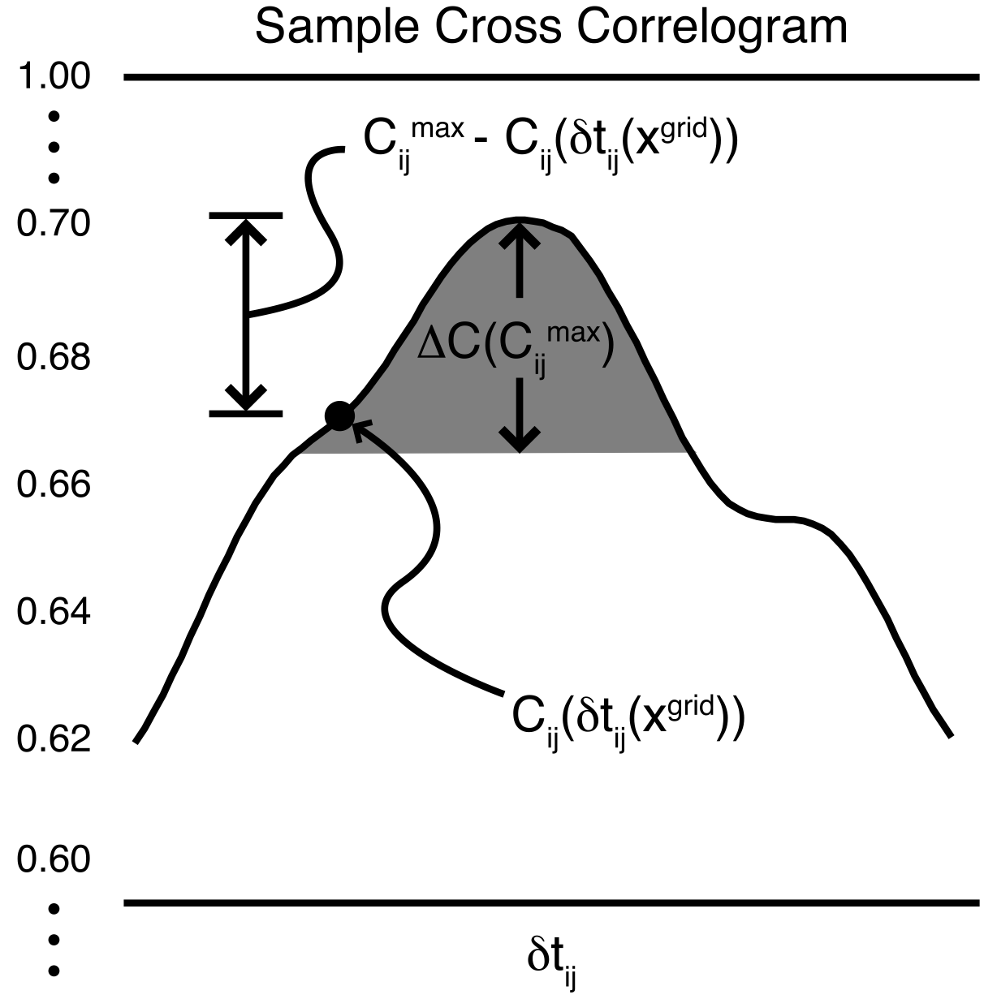

Introduction
============

Background
----------
*enveloc*, first and foremost, is a **location tool**.

The envelope cross correlation approach and underlying algorithms in *enveloc* were originally written
for the automatic detection and location of tectonic tremor in the Pacific Northwest of the US. 
These codes have been used operationally at the |PNSN_link| since 2009 to automatically catalog
|pnsn_tremor_link|. This origin leads to the assumption that the package serves as a tremor detector,
which this is a mischaracterization. The code *can* be used that way, but it doesn't have to be.

.. |PNSN_link| raw:: html

	<a href="https://pnsn.org/" target="_blank">Pacific Northwest Seismic Network</a>

.. |pnsn_tremor_link| raw:: html

	<a href="https://pnsn.org/tremor" target="_blank">tremor there</a>

The envelope cross correlation method is not limited to locating tremor sources, but can be applied
to *any* seismic source, including earthquakes. It is not always the best choice for locating a source.
Obviously earthquakes are better located with traditional earthquake location routines using *P* and *S* 
arrival picks. But in cases where picking an onset or arrival is impossible because

	1) A high noise floor masks onset times
	2) The underlying source process results in an emergent signal
	3) The signal is continuous 

*enveloc* is a tool to help constrain the source location.

Location
--------
Locating relies on a grid search. For each node in a 3D grid, the theoretical traveltimes are calculated to
each station provided, which results in a predicted differential traveltime for each station pair. The algorithm 
seeks to maximize network coherency by finding the grid node that minimizes the difference between the maximum 
correlation between two stations and the correlation value associated with the predicted differential travelitme:

    Example normalized cross correlogram between the envelopes of stations :math:`i` and :math:`j`
    as a function of lag time :math:`{\delta}t`. The correlogram :math:`C_{ij}` evaluated at  the differential *S*-wave travel time :math:`{\delta}t_{ij}(x^{grid})` results in the predicted cross correlation for that grid node :math:`C_{ij}[{\delta}t_{ij}(x^{grid})]`.
    The algorithm minimizes the vertical correlation distance by minimizing the sum over station pairs of 
    :math:`\sum[{C_{ij}^{max} - C_{ij}[{\delta}t_{ij}(x^{grid})]}]` inversely weighted by its uncertainty 
    :math:`{\Delta}C_{ij}^{max}`. See
    |reference_link| for more details.

    .. |reference_link| raw:: html

    	<a href="https://agupubs.onlinelibrary.wiley.com/doi/full/10.1029/2008GL035458" target="_blank">Wech & Creager, 2008</a>

A channel that doesn't correlate with any other channels above the minimum threshold does not contribute 
to the location. If a channel only correlates with a subset of other channels above the minimum threshold, then
only those relevant correlations contribute.

.. _Uncertainty Summary:

Uncertainty
-----------
Uncertainty is certainly poorly constrained. The code can perform a bootstrap test for each location by randomly
removing a small percentage of the cross correlations *N* times, resulting in *N* locations. The scatter of those 
*N* locations is indicative of how stable the overall location (using all the data) is, but the scatter does NOT
represent a true uncertainty estimate. For example, repeated location attempts with a subset of the data can result in 
a source estimate at the same grid node over and over again. In that case the scatter would be 0 km, which obviously
does not reflect the true error. In general I tend to ignore vertical scatter and to discard locations where
the horizontal scatter is greater than 5 km.

Applications
------------
A few examples:

#. Locating a single event
	For a single discrete-ish event surrounded by a seismic network, filtering the data and passing them as envelopes
	to *enveloc* with an appropriate velocity model will help provide a quick and dirty location estimate. This can 
	even be done interactively in *enveloc* allowing the user to select and remove stations and relocate to understand 
	the effects of different stations and data quality
#. Finding volcanic seismicity
	*enveloc* could be run periodically on continuous seismic data from a volcano network to routinely search for volcanic
	seismicity, which could include long-period events, tremor and earthquakes. Externally, the results could then 
	be cataloged or even alarmed.
#. Tectonic tremor
	*enveloc* was orignally designed to search through continuous data and attempt a location on overlapping 5-minute
	windows. *enveloc* allows you to input long data streams, and internally it will iterate through user-defined window
	slices and attempt to locate each one. The output can serve as the first step in detecting tremor
	(more on that below).
	

.. _Detection Summary:

Detection
---------
One of *enveloc*'s strengths is its ability to automatically attempt the location of 100s or 1000s of short windows 
within a longer data stream. During this process though, *enveloc* will identify any coherent seismic signal, so any 
successful location is considered a detection. As discussed above, this could be *anything*. So by itself, the 
output of 100s or 1000s of locations may or may not represent seismicity of interest. For tectonic tremor detection,
a secondary process is required. *enveloc* includes a method that starts with all those locations, and applies a 
clustering algorithm to check for spatio-temporal clustering that is more indicative of tremor-like activity.
The result is seismicity that clusters in space and time, but still, that may or may not be tremor. It could also
be an earthquake swarm or a mainshock-aftershock sequence. Background earthquake activity is important, as is the 
nature of the possible tremor signal itself (does it last for hours per day, or is it just a few minutes per month?).
I find there's no subsitute for looking at the data.

Limitations
-----------
Envelope cross correlation is not always the best method to use, and using *enveloc* has its drawbacks:

#. Creating envelopes inherently degrades temporal resolution, which will affect the resulting spatial
   resolution. Horizontal uncertainty is briefly discussed above in the :ref:`Uncertainty Summary`
   section, but envelopes particularly impact depth resolution. In general, depth output should be viewed 
   as an approximate guide. The code can distinguish between something happening at the surface and 
   something 10, 25 or 40 km deep, and systematic differences in many locations may have meaning. But 
   beyond that it is probably unwise to overinterpret.
#. Because location is based on a grid search, the code will always provide a solution. As discussed in the :ref:`Detection Summary`
   section above, this means care must be taken when interpreting the output.
#. The code does not work on signals with little amplitude variation. In this case there's little structure for the
   envelopes correlate.
#. Issues can arise when the start or end of a window is in the middle of a high-amplitude event. In this case
   all stations correlate well with essentially zero lag, which erroneously places the event in the middle of the
   network. There is a flag that searches for this scenario, but it isn't fool proof
#. **AUTOMATION IS HARD.** *enveloc* has a lot of internal checks and quality-control measures to try and handle the most
   conspicuous gotchas, but nothing is bulletproof. Even traditional earthquake locations (which we've known how to
   do for a long time now) require a human analyst. Trying to automate the detection and location of messy seimsicity
   requires an iterative approach that necessitates looking at the data.
