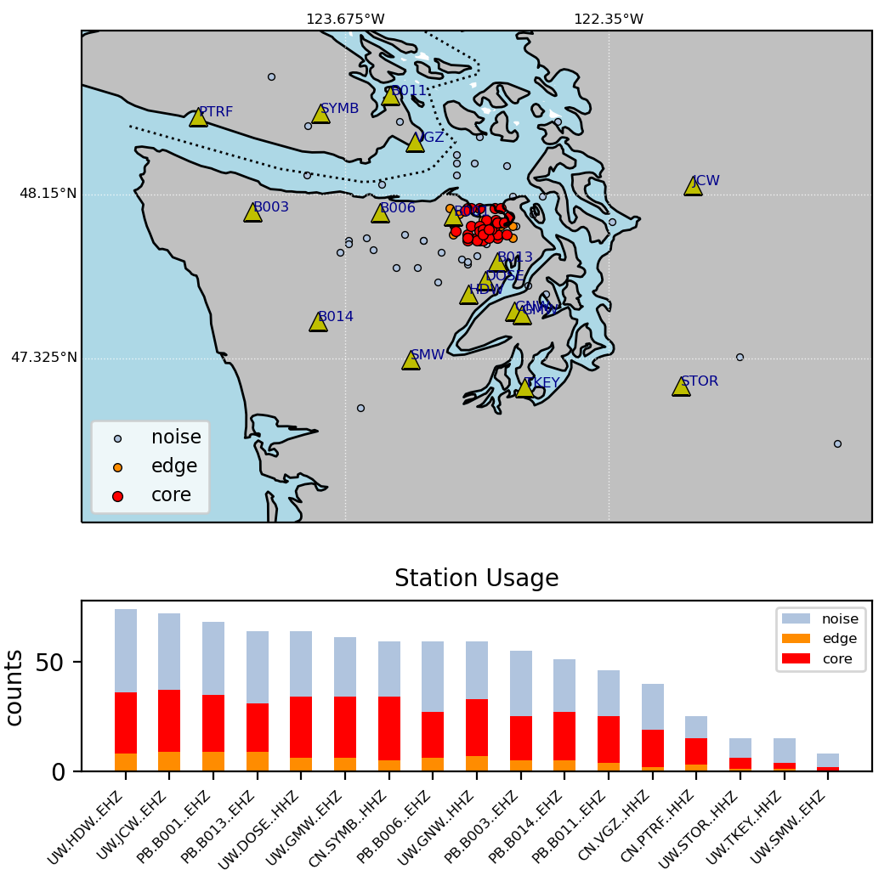

# Output

## Single location

The location *loc* of a single window of data (e.g. [here](tutorial.md#locate-a-signal)) is output as a
location object, `location`, which has attributes:

* latitude
* longitude
* depth
* horizontal_scatter
* vertical_scatter
* starttime
* endtime
* channels
* reduced_displacement (optional...and not well tested)

Each of these values are set to `None`, `[]`, or `np.nan` if no location was determined (too few stations
correlating, location on grid edge, data quality issues, etc.).

`channels` is a list of tuples, each containing `(channel, sta_lon, sta_lat)`, that actually participated
in the location, and `loc.station_latlons()` will return a list of channel names and numpy arrays of
channel latitudes and longitudes.

## Multiple locations

If you used *enveloc* to locate many windows (e.g. [here](tutorial.md#parallel-processing)), the output
`locs` will be an [`event_list`](event_list.md) object, whose sole attribute is *events*, where
*locs.events* is a list of [location objects](#single-location) `[location, location, ...]`. These can be
accessed by either:

```python
event_list = locs.tolist()
```

or

```python
event_list = locs.events
```

where

```python
print(event_list[0])

location(latitude=47.925
longitude=-122.45
depth=20.0
horizontal_scatter=0.0
vertical_scatter=0.0
starttime=2020-05-24T00:00:00.008400Z
endtime=2020-05-24T00:05:00.008400Z
channels=[('PB.B003..EHZ', -124.140862, 48.062359), ('PB.B013..EHZ', -122.910797, 47.813), ('PB.B014..EHZ', -123.8125, 47.513302), ('UW.STOR..HHZ', -121.9888, 47.188099)]
reduced_displacement=None)
```

The [`event_list`](event_list.md) object has several methods to manipulate this list of locations. Among
these is the ability to remove locations with too much scatter or *null* result, `event_list.remove`:

```python
print(locs)
event_list object containing 191 events

new_locs = locs.remove(max_scatter=5,rm_nan_loc=True,rm_nan_err=True,inplace=False)

print(new_locs)
event_list object containing 140 events
```

Filter out location objects based on various properties, `event_list.filter`:

```python
new_locs2 = new_locs.filter(min_lat=48)

print(new_locs2)
event_list object containing 84 events
```

Or get arrays of location attributes:

```python
lats = new_locs.get_lats()
lons = new_locs.get_lons()
starttimes, endtimes = new_locs.get_times()
```

## Clustering

For some seismic sources, like tectonic tremor or earthquake swarms, it can be useful to look for
spatio-temporal clustering of the resulting autolocations and use clustering as a criterion for detection.
`event_list` has the built-in ability to apply spatio-temporal clustering, `event_list.cluster`, to create
sub-lists of clustered locations:

```python
detections = new_locs.cluster(dx=8,dt=60,num_events=4)

print(detections)

DETECTION object with attributes:
(detections: 140 events
all_clustered: 67 events
core_clustered: 60 events
edge_clustered: 7 events
noise: 73 events)
```

The clustering uses `sklearn.cluster.DBSCAN`
([documentation](https://scikit-learn.org/stable/modules/generated/sklearn.cluster.DBSCAN.html) and
[demo](https://scikit-learn.org/stable/auto_examples/cluster/plot_dbscan.html#sphx-glr-auto-examples-cluster-plot-dbscan-py))
and outputs a [detections](detections.md) object which contains different `event_list` objects
as attributes:

* **detections**     - events from original event list
* **core_clustered** - events who all meet the criteria
* **edge_clustered** - events within *dx* & *dt* distance of **core_clustered** event, but don't themselves have *num_events* within *dx* & *dt* of them
* **noise**          - events that don't meet either criteria above
* **all_clustered**  - core_clustered + edge_clustered combined for convenience

This object allows for lists of all events, clustered events, and unclustered events to exist all in one
place and be modified using the same class methods. To access the data from a `detection` object, for
example all **core_clustered** events, simply call:

```python
core_list = detections.core_clustered

print(core_list)
event_list object containing 60 events
```

or get the lat/lon data:

```python
clustered_lats = detections.core_clustered.get_lats()
clustered_lons = detections.core_clustered.get_lons()
```

## Clustering Example

```python
from enveloc.core import XCOR
from enveloc import example_utils
import numpy as np

t1 = '2020-05-24 00:00'
t2 = '2020-05-24 08:00'

FREQMIN = 1.5
FREQMAX = 6.0
LOWPASS = 0.1

sta_list=[
           'PB.B011.--.EHZ',
           'CN.SYMB.--.HHZ',
           'CN.PTRF.--.HHZ',
           'CN.VGZ.--.HHZ',
           'UW.JCW.--.EHZ',
           'PB.B003.--.EHZ',
           'PB.B006.--.EHZ',
           'PB.B001.--.EHZ',
           'PB.B013.--.EHZ',
           'UW.DOSE.--.HHZ',
           'UW.HDW.--.EHZ',
           'UW.GNW.--.HHZ',
           'UW.GMW.--.EHZ',
           'PB.B014.--.EHZ',
           'UW.SMW.--.EHZ',
           'UW.STOR.--.HHZ',
           'UW.TKEY.--.HHZ',
         ]

# get & pre-process data into envelopes
env = example_utils.get_IRIS_data(sta_list,t1,t2,f1=FREQMIN,f2=FREQMAX,lowpass=LOWPASS)

# create XCOR object
mygrid = {'lons': np.arange(-125,-121+0.05,0.075),
          'lats': np.arange(46.5,49.0+0.05,0.075),
          'deps': np.arange(20,60+0.1,4)}

XC = XCOR(env,bootstrap=10,plot=False,grid_size=mygrid,output=1,num_processors=4,regrid=True)

# locate 5-minute windows with 20% overlap:
locs = XC.locate(window_length=300,step=240)

# remove windows with null location and too much bootstrap scatter from list
locs = locs.remove(max_scatter=5,rm_nan_loc=True,rm_nan_err=True,inplace=False)

# cluster
detections = locs.cluster(dx=8,dt=60,num_events=4)

# plot
detections.plot_locations(XC)
```

which results in the following:

<figure markdown="span">
  { width="500" }
  <figcaption>
  <strong>Top:</strong> a map of the grid search area with stations (triangles) and detections (dots).
  Light blue dots represent all successful locations. Red and orange dots represent <code>core</code> and
  <code>edge</code> clustered events, respectively, as described in the
  <a href="#clustering">clustering section above</a>.
  <strong>Bottom:</strong> histograms of station contributions to all (light blue), edge (orange) and
  core (red) clustered events.
  </figcaption>
</figure>
