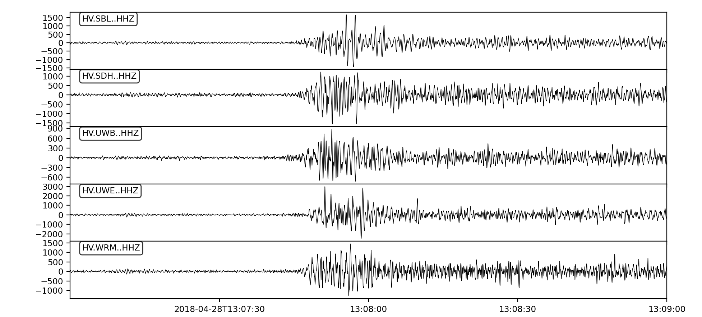
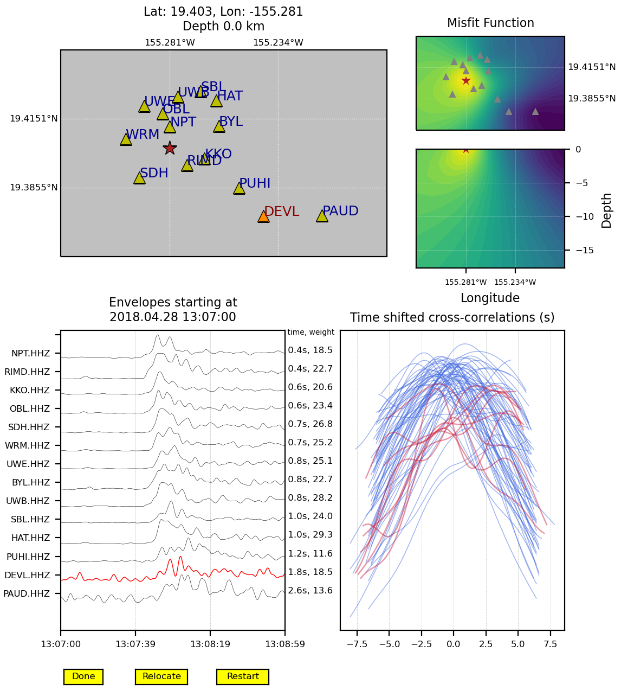

Tutorial
========

This section provides some basic examples for how to use **enveloc**. There are way to many knobs to turn to go over all of the parameters and functionality in detail. The goal here isn't to make you a pro user. This section is meant to help you understand how it works and if/how it could work for your application. After gaining some comfort and familiarity, I recommend checking out more parameters in the :ref:`xcor class` reference page.

First Steps
-----------

Data input
__________

Start by getting some seismic data. As mentioned in the :ref:`seismic data` section, data needs to 
be pre-processed before calling enveloc. Let's get a couple minutes of data from Kilauea volcano during the onset of lava-lake tremor, an emergent signal:

Then filter and convert to smoothed envelopes:

.. code-block:: 

	from enveloc import example_utils

	t1 = '2018-04-28 13:07'
	t2 = '2018-04-28 13:09'

	FREQMIN = 1.0
	FREQMAX = 8.0
	LOWPASS = 0.2

	sta_list=[
	           'HV.BYL..HHZ',
	           'HV.DEVL..HHZ',
	           'HV.HAT..HHZ',
	           'HV.KKO..HHZ',
	           'HV.NPT..HHZ',
	           'HV.OBL..HHZ',
	           'HV.PAUD..HHZ',
	           'HV.PUHI..HHZ',
	           'HV.RIMD..HHZ',
	           'HV.SBL..HHZ',
	           'HV.SDH..HHZ',
	           'HV.UWB..HHZ',
	           'HV.UWE..HHZ',
	           'HV.WRM..HHZ',
	         ]
	env = example_utils.get_IRIS_data(sta_list,t1,t2,f1=FREQMIN,f2=FREQMAX,lowpass=LOWPASS)

Creating *XCOR* object
______________________

With an Obspy stream of envelopes, *env*, in hand, the first step is to create an *XCOR* object, :class:`core.XCOR`. The :class:`core.XCOR` object is everything. It calculates the traveltime grid. It cross correlates all the traces. It handles the grid search. It has a bunch of possible input parameters (see :ref:`xcor class`), but for now we can create one with just the envelopes:

.. code-block:: python

	from enveloc.core import XCOR	
	XC = XCOR(env)

When creating an :class:`core.XCOR` object, *XCOR* organizes the traces for cross correlation and internally calculates traveltimes to all stations, which are stored in *XC*. In the above case, where no additional input is provided, a default grid is created (see :ref:`grid section` section) and traveltimes are calculated using the default *S*-wave velocity model (see the :ref:`velocity model` section).

.. _locate a signal:

Locate a signal
_______________
Now with the *XC* object created, we can try and locate the signal with *XCOR*'s locate method, :meth:`XCOR.locate`:

.. code-block:: python

	loc = XC.locate()

Alternatively, you could do all of the above steps in one test:

.. code-block:: python

	from enveloc import example_utils
	loc, XC = example_utils.interactive_example()

By default the code will attempt a single location and produce an interactive plot:

    Interactive plot produced by *enveloc*. Click on a trace to select. Click on trace again to de-select. Selected traces are highlighted, as is the station on the map and all associated cross correlograms. If '*Relocate*' is pressed, the code will attempt to relocate with the selected traces removed from the algorithm. '*Restart*' returns all orginal traces. '*Done*' exits interactive mode and closes the figure.

.. note::
	The interaction part has only been lightly tested, and there may be possible bugs with the UI here. Make sure to disable any matplotlib backend. 
	
	All the processing and location stuff (sans-interaction mode) are fairly well tested though.

See the :ref:`output section <single location>` for details about the output variable *loc* in this case.

Grid Inputs
-----------

*enveloc* will automatically produce a grid if none is provide, but creating and inputing a grid is strongly recommended. This can be done either as a lat/lon/depth or x/y/z grid. In both cases, the custom grid is input as a dictionary with the relevant grid parameters.

Custom lat/lon grid
___________________
Now we can try using the same data as above, but locating on a custom grid:

.. code-block:: python

	import numpy as np

	mygrid={ 'deps': np.arange( 0, 14 ,0.5),
	         'lons': np.arange(-155.35,-155.2,0.002),
	         'lats': np.arange(  19.35, 19.45,0.002)}

	XC = XCOR(env,grid_size=mygrid,interact=False)
	loc = XC.locate()

In this case we input the custom grid as an argument to *XCOR*, and we turn off interactive mode with *interact=False* (this latter step is unrelated, but an example of how one might do so)

Custom rotated grid
___________________
Again, using the same data as above, we can try locating on a custom rotated grid:

.. code-block:: python

	import numpy as np

	my_rotation={'x'    : np.arange(-5,5,0.3),
	             'y'    : np.arange(-3.5,3.5,0.3),
	             'z'    : np.arange(0,25,2),
	             'lat0' : 19.403,
	             'lon0' : -155.281,
	             'az'   : 30 }	

	XC = XCOR(env,rotation=rotation,interact=False)
	loc = XC.locate()

Where the *rotation* argument is set to the dictionary variable *my_rotation*.
You can view the grid by calling :meth:`XCOR.plot_grid`:

.. code-block:: python

	XC.plot_grid()

which produces the following:

.. figure:: rotated_grid.png
    :width: 500px
    :align: center

    Grid plot produced by *enveloc*.

It's OK if stations fall outside the grid.

Regional Example
________________
Here is an example locating tectonic tremor in Pacific Northwest of the USA.

.. code-block:: python

	from enveloc import example_utils
	loc, XC = example_utils.cascadia_example() 

In this example XC loc is created in `cascadia_example()` by the command:

.. code-block:: python

	XC = XCOR(env,grid_size=mygrid,regrid=True,bootstrap=30,output=2)

which:

#. Uses a custom lat/lon grid
#. Regrids. After finding the minimum misfit grid-node, it relocates on a finer scale grid 
   surrounding the original grid node
#. Bootstraps. It attempts 30 locations, throwing away a small percentage (Default=4%) of the
   correlations each time to create a cloud of scattered locations, which can be used to estimate location robustness.
#. Increases output. The *output* variable increases how much output is print to the screen when 
   *enveloc* runs. Higher integers (up to 4) means much chattier.

Auto-locations
--------------

Rather than locate a single time window, *enveloc* is designed such that you can input a long time series to try and locate many time windows.

Making Windows
______________

All of the above steps are the same: you pre-process the data beforehand, and hand *enveloc* envelopes, a velocity model and a grid. However, now instead of supplying an Obspy Stream of envelopes spanning a few minutes, you input hours or days of data.

.. code-block:: python

	from enveloc import example_utils

	t1 = '2020-05-24 00:00'
	t2 = '2020-05-24 08:00'

	FREQMIN = 1.5
	FREQMAX = 6.0
	LOWPASS = 0.1

	sta_list=[
	           'PB.B011.--.EHZ',
	           'CN.SYMB.--.HHZ',
	           'CN.PTRF.--.HHZ',
	           'CN.VGZ.--.HHZ',
	           'UW.JCW.--.EHZ',
	           'PB.B003.--.EHZ',
	           'PB.B006.--.EHZ',
	           'PB.B001.--.EHZ',
	           'PB.B013.--.EHZ',
	           'UW.DOSE.--.HHZ',
	           'UW.HDW.--.EHZ',
	           'UW.GNW.--.HHZ',
	           'UW.GMW.--.EHZ',
	           'PB.B014.--.EHZ',
	           'UW.SMW.--.EHZ',
	           'UW.STOR.--.HHZ',
	           'UW.TKEY.--.HHZ',
	         ]

	env = example_utils.get_IRIS_data(sta_list,t1,t2,f1=FREQMIN,f2=FREQMAX,lowpass=LOWPASS)

Now we can locate windows of length 300 seconds overlapping by 150 seconds:

.. code-block:: python

	import numpy as np
	from enveloc.core import XCOR

	mygrid = {'lons': np.arange(-125,-121+0.05,0.075),
	          'lats': np.arange(46.5,49.0+0.05,0.075),
	          'deps': np.arange(20,60+0.1,4)}

	XC  = XCOR(env,bootstrap=20,plot=False,grid_size=mygrid,output=2)
	locs = XC.locate(window_length=300,step=150)

.. _parallel processing:

Parallel Processing
___________________

Processing all these windows takes some time. That took about ~260 seconds on my 2018 MacBook Pro (the location step, not the *XC=XCOR(...)* step that calculates traveltimes...more on that later). We can speed that up by using multiple processors. You can do that by changing the number of processors used:

.. code-block:: python

	XC  = XCOR(env,bootstrap=20,plot=False,grid_size=mygrid,output=2,num_processors=4)
	locs = XC.locate(window_length=300,step=150)

Only looping over location windows is parallelized. Increasing to 4 processors reduces the location step of 191 windows to ~50 seconds on my machine.

See the :ref:`output section<multiple locations>` for more discussion on the output *locs*.

Saving traveltimes
__________________

You can see that performing the traveltime calculation can take a long time, especially for high-density grids. The above example took ~32 seconds on my machine, with a relatively small grid. More vertical grid nodes make for longer computation times. If you are performing this step routinely, this can be a huge time sink. For this reason, the *XCOR* object has the method :meth:`XCOR.save_traveltimes`, that allows you to save the traveltimes as a compressed numpy *.npz* file to be loaded later.

.. code-block:: python

	XC.save_traveltimes('example_tt_file.npz')

This file can then be loaded in much faster later when creating the XC object with the same station/grid combo, which speeds things up considerably. The filename can be a full path and is passed by via the argument *tt_file*.

.. code-block:: python

	XC  = XCOR(env,bootstrap=20,plot=False,grid_size=mygrid,output=2,num_processors=4,tt_file='example_tt_file.npz')

Python clocked this at 0.03 seconds, which is a bit faster.

.. note::
	*XCOR* does try to check to make sure the input grid and stations match the data in the input *.npz* file of pre-calculated traveltimes. This has been lightly tested but you should be careful nonetheless.